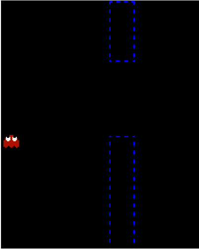
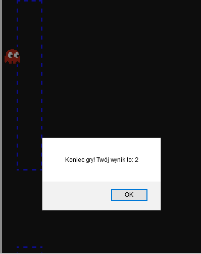

#Laboratorium numer 4

W ramach laboratorium wykonano grę przeglądarkową. Podczas rogrywki gracz wciela się w duszka 
z popularnego Pacmana i próbuje się przedostać jak najdalej w ramach mechaniki znanej  gry Flappy Bird.

##Instrukcja

Gracz próbując walczyć z grawitacją za pomocą lewego przycisku myszy próbuje ominąć jak najwięcej przeszkód.
Każda ominięta przeszkoda to +1 punkt. Łączna liczba punktów wyświetlana jest, gdy nastąpi kolizja z przeszkodą.

##Zrzuty ekranu

Widok rozgrywki:

Widok zdobytych punktów:

