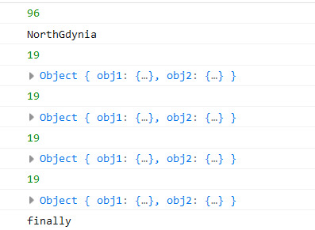

# Laboratorium numer 5

Laboratorium miało na celu zapoznanie się z zapytaniami asynchronicznymi w JS.
Zrealizowano po dwa przykłady dla każdego z 6 poleceń:

1. funkcja zwrotna (callback)
- utwórz obiekt JSON, zawierający w środku co najmniej podwójnie zagnieżdżone obiekty JSON;
ww. obiekty powinny zawierać w tablicach i wartościach obiektów liczby i łańcuch znakowe,
- task1: wykorzystaj funkcję zwrotną do pobrania dwóch różnych wartości liczbowych (z różnych poziomów zagnieżdżenia) z ww. obiektu JSON i wykonaj wybrane działanie na tych liczbach,
- task 2: wykorzystaj funkcję zwrotną do pobrania dwóch różnych łańcuchów znakowych (z różnych poziomów zagnieżdżenia) z ww. obiektu JSON i za pomocą template strings stwórz łańcuch znakowy z użyciem obu wcześniej wyekstrahowanych łańcuchów znakowych.

2. obiekt Promise (resolve, reject) z metodami then(), catch() i finally() + axios (lub fetch)
- task 1: wykorzystaj obiekt Promise do pobrania dwóch różnych zasobów liczbowych i napisz funkcję wykonującą wybrane działanie na tych liczbach,
- task 2: wykorzystaj obiekt Promise do pobrania dwóch różnych dowolnych zasobów i napisz funkcję tworzącą z nich nowy obiekt,
- należy pamiętać o obsłudze wszystkich pięciu metod obiektu Promise,
- do pobierania zasobów należy wykorzystać metodę fetch lub bibliotekę axios.

3. async/await + fetch (lub axios)
- task 1: jak wyżej,
- task 2: jak wyżej,
- należy stworzyć funkcje wykorzystujące składnię async/await,
- do pobierania zasobów należy wykorzystać metodę fetch lub bibliotekę axios.

4. Zapytania AJAX
- task 1: jak w pkt. 2 i 3,
- task 2: jak w pkt. 2 i 3.
- należy obsłużyć sukces zapytania (właściwość ‘onload’ obiektu XHR),
- należy obsłużyć błąd zapytania (właściwość ‘onerror’ obiektu XHR).

5. metoda fetch -- wykonano razem z poleceniem numer 2
- task 1: jak w pkt. 2 i 3,
- task 2: jak w pkt. 2 i ,
- nie używamy async/await.

6. bibliotexa axios
- task 1: jak w pkt. 2 i 3,
- task 2: jak w pkt. 2 i 3,
- obiekt axios dostępny będzie jako response.data (patrz przykłady),
- nie używamy async/await.
- wystarczy użyć plików z CDN, opisanych w linku do biblioteki i umieścić je przed końcem sekcji ‘body’.

## Zrzut ekranu przedstawiający zrealizwoane zadanie

