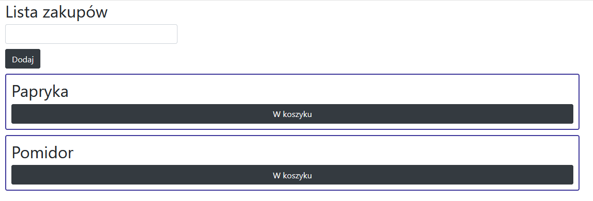
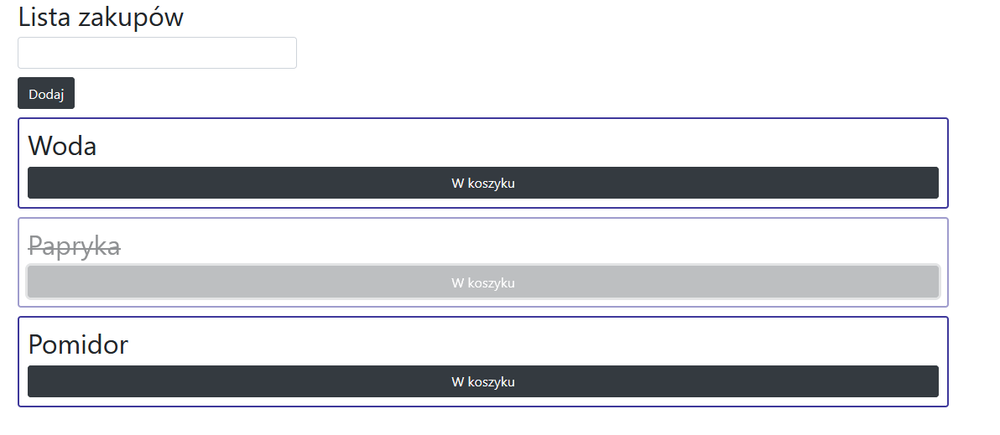
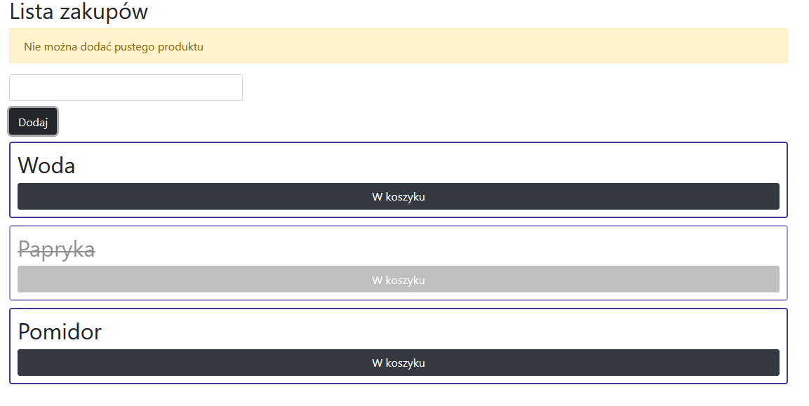

# Laboratorium numer 6

Laboratorium miało na celu zapoznanie się z Reactem oraz stworzenie aplikacji za pomocą modułu ‘create-react-app’.
Zapoznano się z komponentami funkcyjnymi i klasowymi oraz ich wykorzystaniem.

W ramach projektu stworzono aplikację do tworzenia listy zakupów.
Zrealizowano w mniej następujące zadania:

- stworzenie aplikacji za pomocą modułu ‘create-react-app’,
- stworzenie komponentów funkcyjnych i klasowych,
- utworzenie komponenu nadrzędnego i  komponenty potomne,
- wykorzystano props (atrybuty, właściwosci) przy przekazywaniu danych do komponentu potomnego,
- wykorzystano state (stan) przy tworzeniu komponentu klasowego,
- dodano plik .css do wybranych komponentów,
- zastosowano funkcję map() przy generowaniu komponentów pamiętając o atrybucie key,
- zrealizowano wysyłanie funkcji za pomocą ‘props’,
- wykorzystano react-bootstrap’a w create-react-app.

## Działanie aplikacji:

Wygląd listy zakupów:

Dodanie elementów do listy poprzez wypełnienie pola i wciśnięcie przycisku "Dodaj"
produkty są "skreślane" po wciśnięciu przycisku "W koszyku"

Podczas próby dodania "pustego" produktu wyświetlany jest alert:

