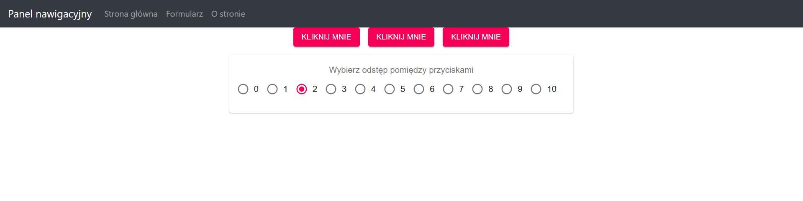
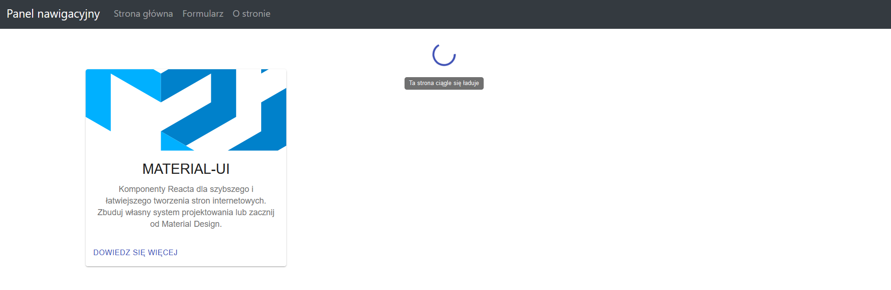

# Laboratorium numer 7

Laboratorium miało na celu wykorzystanie Material UI oraz React-Router do utworzenia prostej SPA

Zrealizowano następujące zadania:

- wykorzystano dwie ww. biblioteki react’owe do utworzenia prostej SPA,
- stworzono trzy “podstrony” z użyciem komponentów link, Switch i Route,
- na każdej z ww. podstron co najmniej 3 różne komponenty z Material UI,
- wykorzystano Bootstrap do stworzenia Panelu nawigacyjnego na górze strony

## Wykonana strona:

### Strona główna

Wykorzystano mniędzy innymi następujące komponenty:
- Button
- Grid
- Paper
- FormControl

### Formularz 

Wykorzystano mniędzy innymi następujące komponenty:
- Form
- Radio
- RadioGroup
- TextField
- FormLabel

### O stronie 

Wykorzystano mniędzy innymi następujące komponenty:
- Card
- Typography
- Container
- CircularProgress
- Tooltip

