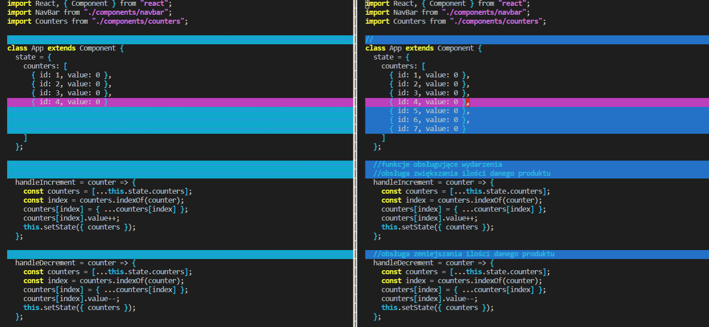
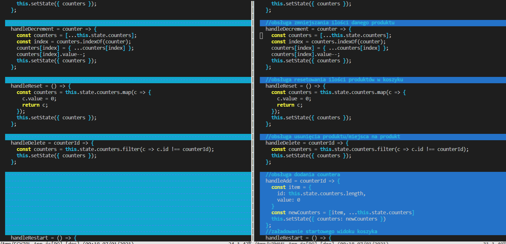
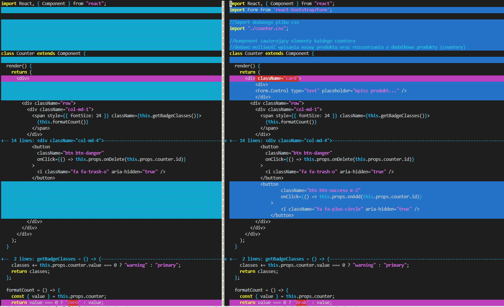

# Laboratorium numer 8

Laboratorium miało na celu implementację wybranego przykładu aplikacji Reactowej, modyfikację jej 
oraz przedstawienie wprowadzonych modyfikacji za pomocą git difftool

Zrealizowano następujące zadania:

- zaimplementowano projekt strony zliczający ilość różnych produktów w koszyku 
oraz pozwalający na wskazanie ilości danego produktu,
- w ramach modyfikacji dodano dodawanie kolejnych produktów wraz z możliwością wpisania ich nazwy,
- zmiany w kodzie zostały przedstawione za pomoca git difftool

[Projekt przed modyfikacjami](https://obscure-waters-60500.herokuapp.com/)

[Kod źródłowy](https://github.com/arnab-datta/counter-app)

## Strona po modyfikacjach:

### git difftool

App.js

counter.jsx

